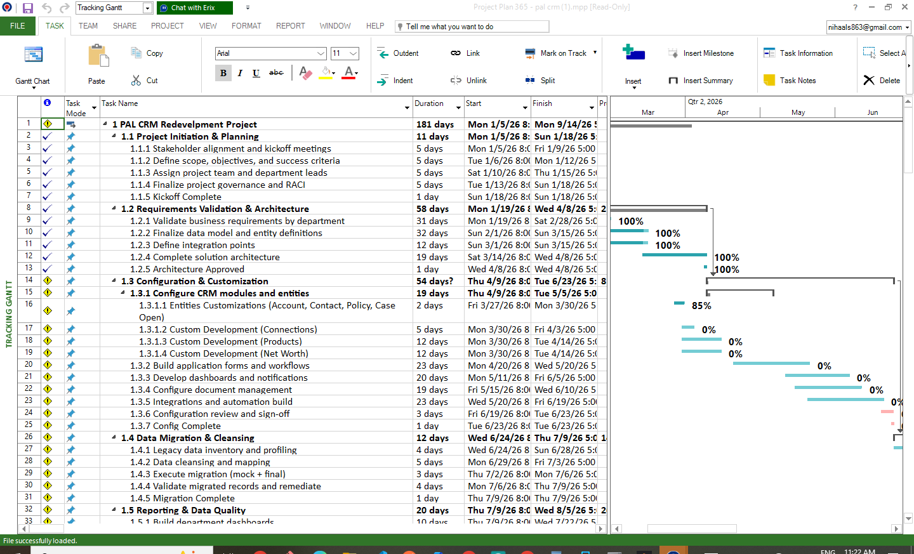

CRM Implementation Project
Status Update — Gantt Chart & Work Breakdown Structure

Prepared by:  VI Professional Solutions Inc.
Prepared for:  PAL INSURANCE SERVICE LTD
Date:  March 23, 2026
Project Duration:  January 5 – September 14, 2026 (253 calendar days)

Executive Summary
This document provides a comprehensive status update for the CRM Implementation Project being delivered by VI Professional Solutions Inc. for PAL Insurance Service Ltd. The project is currently in Phase 3 — Configuration & Customization, which has been extended by approximately two weeks to accommodate expanded workflow automation and integration requirements. The overall project timeline has been adjusted accordingly, with all subsequent phases shifted to maintain sequential dependencies while preserving adequate buffer for stabilization ahead of the mid-September go-live.
As of March 23, 2026, the project is approximately 34% complete by elapsed calendar days (78 of 253 days). Phase 1 (Project Initiation & Planning) has been completed, and Phase 2 (Requirements Validation & Architecture) is functionally complete, with minor refinements possible as configuration progresses. Phase 3 (Configuration & Customization) is actively underway, targeting completion by June 23, 2026. The remaining four phases — Data Migration & Cleansing, Reporting & Data Quality, UAT & Training, and Go-Live & Support — are planned and sequenced to follow.
Updated Project Phases
The following table summarizes each project phase, including updated dates, responsible departments, current status, and key deliverables.
Phase	Dates	Departments	Status	Key Deliverables
Project Initiation & Planning	Jan 5 – Jan 18, 2026	All	Completed	Stakeholder alignment; kickoff meetings; finalized scope, objectives, and success criteria; project team and department leads assigned
Requirements Validation & Architecture	Jan 19 – Apr 8, 2026	All	Functionally Complete	Validated business requirements by department; finalized data model and entity definitions; defined integration points; completed solution architecture
Configuration & Customization	Apr 9 – Jun 23, 2026	All (led by IT/Architecture)	In Progress	Configured CRM modules; application forms and workflows; dashboards and reporting templates; integration builds; role-based access and security
Data Migration & Cleansing	Jun 24 – Jul 8, 2026	IT/Data	Planned	Data inventory and profiling; field mapping and transformation rules; mock migration and validation; final migration execution
Reporting & Data Quality	Jul 9 – Aug 5, 2026	All, IT/Data	Planned	Department dashboards; report validation; data quality monitoring; remediation tools and processes
UAT & Training	Aug 6 – Aug 27, 2026	All	Planned	Completed user acceptance testing; issue and defect log; workflow validation; department-specific training; change management support
Go-Live & Support	Aug 28 – Sep 14, 2026	IT/Data, All	Planned	Final cutover; go-live support; post-launch issue resolution; transition to new CRM; optimization feedback

Gantt Chart
The Gantt chart below illustrates the project timeline, showing phase durations, milestone markers, status color-coding, and a reference line indicating the current reporting date. Dependencies between phases are sequential, with each phase beginning after the prior phase milestone is achieved.
 
Key
•  Teal bar: Completed phases
•  Dark teal bar: Functionally complete (minor refinements possible)
•  Rust bar: Currently in progress
•  Light cyan bar: Planned (not yet started)
•  Diamond (◆): Phase milestone

Work Breakdown Structure (WBS)
The Work Breakdown Structure decomposes each project phase into individual tasks and milestones, identifying owners, durations, current status, and dependencies. Phase-level summary rows are shaded in light teal, and milestones are marked with a diamond (◆) symbol and shaded in warm tones.
WBS #	Task / Deliverable	Start	End	Days	Owner	Status	Dependencies
1.0	Project Initiation & Planning	Jan 5	Jan 18	14	All	Completed	—
1.1	Stakeholder alignment and kickoff meetings	Jan 5	Jan 10	6	PAL	Completed	—
1.2	Define scope, objectives, and success criteria	Jan 8	Jan 14	7	VIPROS	Completed	1.1
1.3	Assign project team and department leads	Jan 12	Jan 16	5	PAL	Completed	1.1
1.4	Establish governance and communication cadence	Jan 14	Jan 18	5	PAL	Completed	1.2
—	◆ Milestone: Kickoff Complete	Jan 18	Jan 18	—	All	Achieved	1.4
2.0	Requirements Validation & Architecture	Jan 19	Apr 8	80	All	Functionally Complete	1.0
2.1	Validate business requirements by department	Jan 19	Feb 14	27	PAL	Completed	1.4
2.2	Finalize data model and entity definitions	Feb 10	Mar 7	26	Data	Completed	2.1
2.3	Define integration points and API requirements	Mar 1	Mar 21	21	VIPROS	Completed	2.2
2.4	Complete solution architecture document	Mar 15	Apr 5	22	VIPROS	Functionally Complete	2.3
2.5	Architecture review and sign-off	Apr 5	Apr 8	4	PAL	Functionally Complete	2.4
—	◆ Milestone: Architecture Approved	Apr 8	Apr 8	—	All	Achieved	2.5
3.0	Configuration & Customization	Apr 9	Jun 23	76	All	In Progress	2.0
3.1	Configure CRM modules and workflows	Apr 9	May 10	32	VIPROS	In Progress	2.5
3.2	Build application forms and automation rules	May 1	May 24	24	VIPROS	Planned	3.1
3.3	Develop dashboards and reporting templates	May 18	Jun 7	21	VIPROS	Planned	3.1
3.4	Build integrations and API connections	May 25	Jun 14	21	VIPROS	Planned	3.2
3.5	Configure role-based access and security	Jun 8	Jun 20	13	VIPROS	Planned	3.3
3.6	Configuration review and validation	Jun 18	Jun 23	6	PAL	Planned	3.4, 3.5
—	◆ Milestone: Config Complete	Jun 23	Jun 23	—	All	Planned	3.6
4.0	Data Migration & Cleansing	Jun 24	Jul 8	15	Data	Planned	3.0
4.1	Data inventory and profiling	Jun 24	Jun 28	5	Data	Planned	3.6
4.2	Field mapping and transformation rules	Jun 28	Jul 2	5	Data	Planned	4.1
4.3	Mock migration and validation	Jul 2	Jul 5	4	Data	Planned	4.2
4.4	Final migration execution	Jul 6	Jul 8	3	Data	Planned	4.3
—	◆ Milestone: Migration Complete	Jul 8	Jul 8	—	Data	Planned	4.4
5.0	Reporting & Data Quality	Jul 9	Aug 5	28	All	Planned	4.0
5.1	Build department dashboards	Jul 9	Jul 22	14	VIPROS	Planned	4.4
5.2	Report validation with stakeholders	Jul 20	Jul 28	9	PAL	Planned	5.1
5.3	Data quality monitoring setup	Jul 25	Aug 2	9	Data	Planned	5.1
5.4	Remediation tools and processes	Aug 1	Aug 5	5	Data	Planned	5.2, 5.3
—	◆ Milestone: Reports Validated	Aug 5	Aug 5	—	All	Planned	5.4
6.0	UAT & Training	Aug 6	Aug 27	22	All	Planned	5.0
6.1	Develop UAT test scripts and scenarios	Aug 6	Aug 10	5	VIPROS	Planned	5.4
6.2	Execute user acceptance testing	Aug 11	Aug 19	9	PAL	Planned	6.1
6.3	Defect triage and resolution	Aug 15	Aug 22	8	VIPROS	Planned	6.2
6.4	Department-specific training delivery	Aug 18	Aug 25	8	VIPROS	Planned	6.2
6.5	Change management and go-live readiness	Aug 23	Aug 27	5	PAL	Planned	6.3, 6.4
—	◆ Milestone: UAT Complete	Aug 27	Aug 27	—	All	Planned	6.5
7.0	Go-Live & Support	Aug 28	Sep 14	18	All	Planned	6.0
7.1	Final cutover and go-live execution	Aug 28	Aug 30	3	VIPROS	Planned	6.5
7.2	Post-launch issue resolution	Aug 31	Sep 7	8	VIPROS	Planned	7.1
7.3	Hypercare and stabilization support	Sep 1	Sep 10	10	VIPROS	Planned	7.1
7.4	Transition to steady-state operations	Sep 8	Sep 14	7	PAL	Planned	7.2, 7.3
—	◆ Milestone: Project Complete	Sep 14	Sep 14	—	All	Planned	7.4
Notes
•  Phase 3 (Configuration & Customization) has been extended by approximately two weeks to accommodate expanded workflow automation and value-add integration requirements. This extension is justified by the additional business value delivered.
•  Preliminary data inventory and profiling work is being conducted in parallel during the Configuration phase to de-risk the Data Migration timeline.
•  Consider staggering UAT by department to maintain testing momentum and avoid bottlenecks during the 22-day UAT window.
•  The Go-Live & Support phase includes an 18-day buffer providing adequate time for hypercare, stabilization, and early optimization.
•  All phases remain sequential — each phase begins after the prior phase milestone is achieved. No parallel phase execution is planned except preliminary data inventory during Configuration.
•  Continued engagement from department stakeholders is critical to maintaining the current timeline and avoiding further schedule impact.
•  Go/No-Go Decision is targeted for June 24, 2026, following the Config Complete milestone.
•  Follow-up discussion with Wei Qiao (PAL) regarding final go-live readiness criteria TBD.

